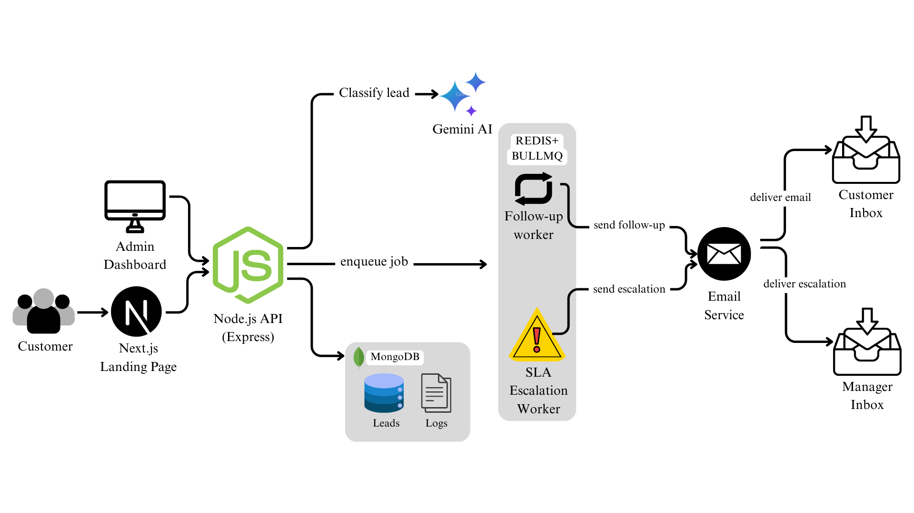

# LeadFlow AI – Intelligent Lead Automation Platform


LeadFlow AI is a production-ready lead capture and automation system built for material brands such as flooring, laminates, lighting, and construction products. It ensures **no lead is missed**, automates **AI-based intent classification**, enforces **SLA accountability**, and provides a **modern admin dashboard** for operations teams.

---

## 🚀 Live URLs

| Service | URL |
|---------|-----|
| **Backend API** | [https://leadapi.batworks.in](https://leadapi.batworks.in) |
| **Health Check** | [https://leadapi.batworks.in/health](https://leadapi.batworks.in/health) |
| **Admin Console** | [https://lead-flow-ai-admin.vercel.app](https://lead-flow-ai-admin.vercel.app) |

---

## 📋 Table of Contents

- [Problem Statement](#-problem-statement)
- [Architecture](#️-high-level-architecture)
- [Key Features](#-key-features)
- [Technology Stack](#️-technology-stack)
- [Project Structure](#-project-structure)
- [Getting Started](#-getting-started)
- [Authentication](#-admin-authentication)
- [Data Models](#-data-models)
- [Automation Logic](#-automation-logic)
- [API Documentation](#-api-endpoints)
- [Testing](#-testing)
- [Deployment](#️-deployment-details)
- [Scalability](#-scalability--reliability)
- [Design Decisions](#-key-design-decisions)

---

## 🧠 Problem Statement

Material brands invest heavily in marketing, but leads are often lost due to:

- ❌ **Delayed responses** – Leads go cold before contact
- ❌ **No prioritization** – All leads treated equally
- ❌ **Manual follow-ups** – Time-consuming and error-prone
- ❌ **Lack of SLA tracking** – No accountability for response times

### ✅ Solution: LeadFlow AI

**LeadFlow AI solves this by automating the complete lead lifecycle:**

- ✅ Instant lead capture with AI intent classification
- ✅ Automated follow-ups based on priority
- ✅ SLA enforcement with escalation alerts
- ✅ Centralized admin dashboard for tracking

---

## 🏗️ High-Level Architecture





---

## ✨ Key Features

### 🎯 Lead Capture
- Website inquiry form integration
- Real-time API validation
- Persistent storage in MongoDB
- Source tracking

### 🤖 AI Classification
- **Intent detection** (High / Medium / Low priority)
- **Category detection** (Pricing, Catalog, Support, General)
- **Urgency analysis** powered by Gemini AI
- Automated lead scoring

### 📧 Follow-up Automation
- Automated follow-up emails based on intent
- Smart scheduling with delay rules
- Non-blocking queue-based execution
- Customizable email templates

### ⚡ SLA Escalation
- SLA timers per lead intent level
- Automatic escalation email on breach
- Full audit logging
- Performance metrics tracking

### 📊 Admin Dashboard
- View and filter all leads
- Update lead status in real-time
- Comprehensive logs & SLA activity
- Secure authentication system
- Modern, responsive UI

---

## 🛠️ Technology Stack

### Backend
| Technology | Purpose |
|-----------|---------|
| **Node.js** | Runtime environment |
| **Express.js** | Web framework |
| **MongoDB** | Primary database (Mongoose ODM) |
| **Redis** | Queue management & caching |
| **BullMQ** | Job queue processing |
| **Gemini AI** | Intent classification |
| **Nodemailer** | Email automation |
| **PM2** | Process management |
| **Nginx** | Reverse proxy |

### Admin Console
| Technology | Purpose |
|-----------|---------|
| **Next.js 14** | Full-stack framework (App Router) |
| **MongoDB** | Direct database access |
| **Tailwind CSS** | Styling |
| **shadcn/ui** | UI components |
| **TypeScript** | Type safety |

---

## 📂 Project Structure

```
lead-flow-ai/
├── Backend/
│   ├── src/
│   │   ├── controllers/
│   │   │   ├── leadController.js
│   │   │   └── logController.js
│   │   ├── routes/
│   │   │   ├── leadRoutes.js
│   │   │   └── logRoutes.js
│   │   ├── services/
│   │   │   ├── aiService.js
│   │   │   └── emailService.js
│   │   ├── queues/
│   │   │   ├── followUpQueue.js
│   │   │   └── slaQueue.js
│   │   ├── models/
│   │   │   ├── Lead.js
│   │   │   └── Log.js
│   │   └── config/
│   │       ├── database.js
│   │       └── redis.js
│   ├── server.js
│   ├── package.json
│   └── .env
│
└── admin-dashboard/
    ├── app/
    │   ├── api/admin/
    │   │   ├── login/route.ts
    │   │   └── logout/route.ts
    │   ├── leads/
    │   │   ├── page.tsx
    │   │   └── [id]/page.tsx
    │   ├── logs/
    │   │   └── page.tsx
    │   ├── dashboard/
    │   │   └── page.tsx
    │   └── layout.tsx
    ├── models/
    │   ├── Lead.ts
    │   └── Log.ts
    ├── lib/
    │   ├── mongodb.ts
    │   └── auth.ts
    ├── middleware.ts
    ├── package.json
    └── .env.local
```

---

## 🚀 Getting Started

### Prerequisites

```bash
# Required installations
Node.js >= 18.x
MongoDB >= 7.0
Redis >= 6.0
npm or yarn
```

### Backend Setup

```bash
# Clone the repository
git clone https://github.com/shreyito/lead-flow-ai.git
cd lead-flow-ai/Backend

# Install dependencies
npm install

# Configure environment variables
cp .env.example .env
# Edit .env with your configurations

# Start MongoDB and Redis
mongod
redis-server

# Run in development
npm run dev

# Run in production
npm start
```

### Admin Dashboard Setup

```bash
cd admin-dashboard

# Install dependencies
npm install

# Configure environment variables
cp .env.example .env.local
# Edit .env.local with your MongoDB URI

# Run development server
npm run dev

# Build for production
npm run build
npm start
```

### Environment Variables

**Backend (.env)**
```env
PORT=5000
MONGODB_URI=mongodb://localhost:27017/leadflow
REDIS_HOST=localhost
REDIS_PORT=6379
GEMINI_API_KEY=your_gemini_api_key
EMAIL_HOST=smtp.gmail.com
EMAIL_PORT=587
EMAIL_USER=your_email@gmail.com
EMAIL_PASS=your_app_password
```

**Admin Dashboard (.env.local)**
```env
MONGODB_URI=mongodb://localhost:27017/leadflow
NEXT_PUBLIC_API_URL=https://leadapi.batworks.in
```

---

## 🔐 Admin Authentication

**Demo Credentials (Hardcoded for Assignment)**

```
Email: admin@gmail.com
Password: admin12345
```

**Security Features:**
- Cookie-based session management
- Protected routes via `middleware.ts`
- Automatic session expiry
- Secure HTTP-only cookies (production)

---

## 🧬 Data Models

### Lead Model

```typescript
{
  name: String,           // Customer name
  email: String,          // Customer email (unique)
  phone: String,          // Customer phone
  product: String,        // Product of interest
  message: String,        // Inquiry message
  source: String,         // Lead source (website, api, etc.)
  intent: String,         // AI-classified: High/Medium/Low
  category: String,       // AI-classified: Pricing/Catalog/Support/General
  urgency: String,        // AI-classified urgency level
  status: String,         // new/contacted/qualified/converted/lost
  createdAt: Date,        // Timestamp
  updatedAt: Date         // Last modified
}
```

### Log Model

```typescript
{
  type: String,           // follow-up/sla/status-change/error
  leadId: ObjectId,       // Reference to Lead
  message: String,        // Log description
  metadata: Object,       // Additional data
  createdAt: Date         // Timestamp
}
```

---

## 🔁 Automation Logic

### Follow-Up Rules

Automated follow-up emails are scheduled based on AI-classified intent:

| Intent | Delay | Rationale |
|--------|-------|-----------|
| **High** | 15 minutes | Urgent leads need immediate attention |
| **Medium** | 2 hours | Standard response time |
| **Low** | 48 hours | Non-urgent, scheduled follow-up |

### SLA Escalation Rules

SLA monitoring ensures timely responses:

- **Trigger Condition:** Lead status remains `new` beyond SLA threshold
- **Action:** Sends escalation email to management
- **Logging:** Full audit trail in logs collection
- **Thresholds:** Configurable per intent level

### Job Queue Processing

```javascript
// Follow-up queue
followUpQueue.process(async (job) => {
  const { leadId } = job.data;
  // Send automated follow-up email
  // Log activity
});

// SLA queue
slaQueue.process(async (job) => {
  const { leadId } = job.data;
  // Check if lead still in 'new' status
  // Send escalation email if breach
  // Log SLA breach
});
```

---

## 🔌 API Endpoints

### Backend API Documentation

| Method | Endpoint | Description | Auth Required |
|--------|----------|-------------|---------------|
| `POST` | `/api/leads` | Create new lead | No |
| `GET` | `/api/leads` | Fetch all leads | No |
| `GET` | `/api/leads/:id` | Fetch lead by ID | No |
| `PATCH` | `/api/leads/:id` | Update lead status | No |
| `GET` | `/api/logs` | Fetch all logs | No |
| `GET` | `/api/logs/:leadId` | Fetch logs for specific lead | No |
| `GET` | `/health` | Health check | No |

### Example: Create Lead

```bash
curl -X POST https://leadapi.batworks.in/api/leads \
  -H "Content-Type: application/json" \
  -d '{
    "name": "John Doe",
    "email": "john@example.com",
    "phone": "+1234567890",
    "product": "Premium Laminate Flooring",
    "message": "Need urgent quote for 500 sq ft",
    "source": "website"
  }'
```

### Example Response

```json
{
  "success": true,
  "data": {
    "_id": "65abc123def456789",
    "name": "John Doe",
    "email": "john@example.com",
    "phone": "+1234567890",
    "product": "Premium Laminate Flooring",
    "message": "Need urgent quote for 500 sq ft",
    "source": "website",
    "intent": "High",
    "category": "Pricing",
    "urgency": "urgent",
    "status": "new",
    "createdAt": "2024-12-28T10:30:00.000Z",
    "updatedAt": "2024-12-28T10:30:00.000Z"
  }
}
```

---

## 🧪 Testing

### Health Check

```bash
# Check API status
curl https://leadapi.batworks.in/health

# Expected response
{
  "status": "ok",
  "timestamp": "2024-12-28T10:30:00.000Z",
  "services": {
    "database": "connected",
    "redis": "connected"
  }
}
```

### Manual Testing

```bash
# Create test lead
npm run test:create-lead

# Test follow-up automation
npm run test:followup

# Test SLA escalation
npm run test:sla
```

### Load Testing

```bash
# Install artillery
npm install -g artillery

# Run load test
artillery quick --count 100 --num 10 https://leadapi.batworks.in/api/leads
```

---

## ☁️ Deployment Details

### Backend Deployment (AWS EC2)

**Server Configuration:**
- **Platform:** Amazon Linux 2023
- **Instance Type:** t2.micro (or higher)
- **Process Manager:** PM2
- **Web Server:** Nginx (reverse proxy)
- **SSL:** Certbot (Let's Encrypt)

**Deployment Steps:**

```bash
# SSH into EC2 instance
ssh -i your-key.pem ec2-user@your-instance-ip

# Install Node.js
curl -fsSL https://rpm.nodesource.com/setup_18.x | sudo bash -
sudo yum install -y nodejs

# Install PM2
sudo npm install -g pm2

# Clone and setup
git clone https://github.com/shreyito/lead-flow-ai.git
cd lead-flow-ai/Backend
npm install

# Start with PM2
pm2 start server.js --name leadflow-api
pm2 save
pm2 startup

# Configure Nginx
sudo nano /etc/nginx/conf.d/leadflow.conf
# Add reverse proxy configuration

# Setup SSL
sudo certbot --nginx -d leadapi.batworks.in
```

**Nginx Configuration:**

```nginx
server {
    listen 80;
    server_name leadapi.batworks.in;
    
    location / {
        proxy_pass http://localhost:5000;
        proxy_http_version 1.1;
        proxy_set_header Upgrade $http_upgrade;
        proxy_set_header Connection 'upgrade';
        proxy_set_header Host $host;
        proxy_cache_bypass $http_upgrade;
    }
}
```

### Admin Console Deployment (Vercel)

```bash
# Install Vercel CLI
npm i -g vercel

# Deploy
cd admin-dashboard
vercel --prod

# Configure environment variables in Vercel dashboard
```

**Vercel Configuration (vercel.json):**

```json
{
  "buildCommand": "npm run build",
  "devCommand": "npm run dev",
  "installCommand": "npm install",
  "framework": "nextjs",
  "env": {
    "MONGODB_URI": "@mongodb-uri",
    "NEXT_PUBLIC_API_URL": "https://leadapi.batworks.in"
  }
}
```

---

## 📈 Scalability & Reliability

### Design Principles

- **Queue-based asynchronous processing** – Non-blocking operations
- **Redis-backed job scheduling** – Reliable task execution
- **Stateless backend services** – Horizontal scaling capability
- **Database indexing** – Optimized queries on email, status, createdAt
- **Error handling & retries** – Failed jobs automatically retried
- **Logging & monitoring** – Full audit trail for debugging

### Performance Optimizations

- Connection pooling for MongoDB
- Redis caching for frequently accessed data
- Paginated API responses
- Lazy loading in admin dashboard
- CDN for static assets

### Monitoring & Observability

```bash
# PM2 monitoring
pm2 monit

# View logs
pm2 logs leadflow-api

# Check queue status
npm run queue:status
```

---

## 🧠 Key Design Decisions

### 1. Separation of Concerns
- **Customer-facing backend** handles lead ingestion
- **Admin backend** (Next.js API routes) handles internal operations
- Clean separation improves security and maintainability

### 2. Direct Database Access in Admin Console
- Admin dashboard connects directly to MongoDB
- Eliminates unnecessary API layer
- Reduces latency and improves performance

### 3. Asynchronous SLA Logic
- SLA monitoring runs in background queue
- Doesn't block main application flow
- Scales independently from API

### 4. Comprehensive Logging
- All actions logged for observability
- Helps with debugging and audits
- Provides accountability trail

### 5. AI-Powered Classification
- Gemini AI analyzes lead intent automatically
- Reduces manual triage time
- Improves response prioritization

---


## 🏆 Project Highlights

This project demonstrates:

- ✅ **Full-stack engineering** – Backend + Frontend + Database
- ✅ **Backend automation** – Queues, jobs, scheduling
- ✅ **AI integration** – Gemini AI for intelligent classification
- ✅ **Production deployment** – AWS EC2, Vercel, SSL, PM2
- ✅ **Scalable system design** – Queue-based, stateless, horizontally scalable
- ✅ **Real-world application** – Solves actual business problem

---

## 👩‍💻 Author

**Shreya Raj Gupta**  
Registration No: 22BHI10143  
GitHub: [@shreyito](https://github.com/shreyito)

---


## 🙏 Acknowledgments

- Gemini AI for intent classification
- MongoDB for reliable data storage
- BullMQ for queue management
- Vercel for seamless deployment


⭐ Star this repo if you find it helpful!
